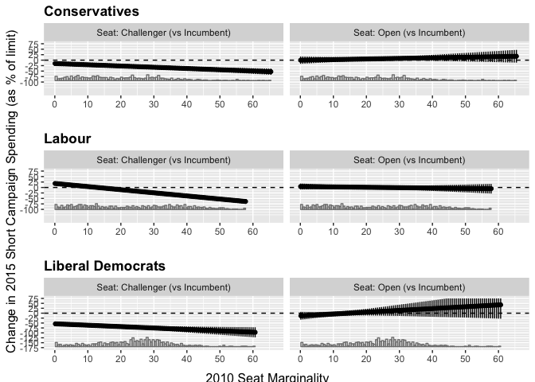
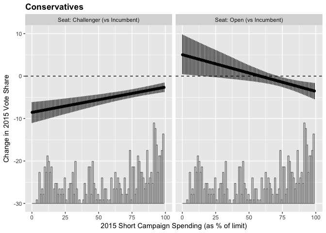
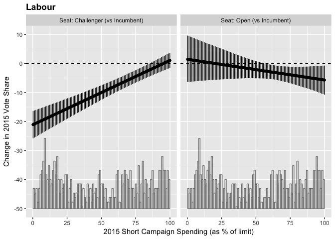
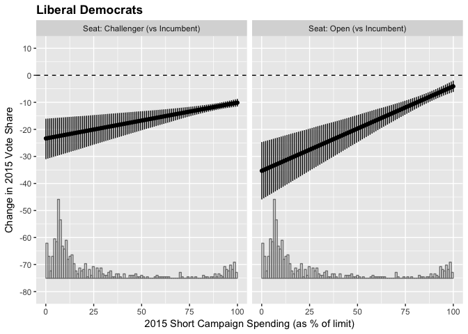
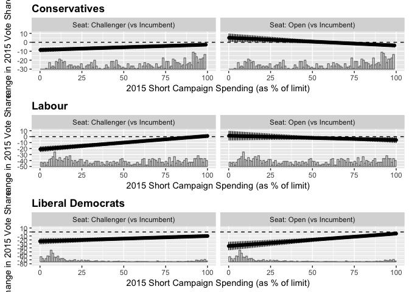

Constituency Campaign Spending Project
================
Todd K. Hartman
2017-05-19

Housekeeping

``` r
## Load packages via pacman
pacman::p_load(dplyr, haven, interplot, plyr, readxl, scales, tidyr)

## Set display options
options("scipen" = 100, "digits" = 4)

## Set the Working Directory
# setwd("~/Dropbox/_RESEARCH/Pattie_Johnston_2015_UK_Election/Campaign_Spending_Project/Data/")  # For Mac OSX
# setwd("C:/Users/Fs1tkh/Dropbox/_RESEARCH/Pattie_Johnston_2015_UK_Election/Campaign_Spending_Project/Data/")  # For PC
```

Load the 2015 campaign spending data

``` r
## Download (or load if downloaded) from the Electoral Commission website
## http://www.electoralcommission.org.uk/find-information-by-subject/elections-and-referendums/past-elections-and-referendums/uk-general-elections/candidate-election-spending
url.15 <- "https://www.electoralcommission.org.uk/__data/assets/excel_doc/0004/199066/2015-UK-Parliament-spending-data.xlsx"
file.15 <- basename(url.15)  # Extract the filename
if (!file.exists(file.15))   # Only download if not in the working directory
    download.file(url = url.15, destfile = file.15, mode = "wb")
spend.15 <- read_excel(file.15)  # Load the dataset

## Subset the data
names(spend.15)
```

    ##  [1] "ConstituencyId"                     
    ##  [2] "EntityId"                           
    ##  [3] "CandId"                             
    ##  [4] "Forename"                           
    ##  [5] "Surname"                            
    ##  [6] "Party Name"                         
    ##  [7] "Constituency Name"                  
    ##  [8] "Constituency Type"                  
    ##  [9] "Area"                               
    ## [10] "Nation"                             
    ## [11] "Electorate (Limit)"                 
    ## [12] "Long Limit"                         
    ## [13] "Short Limit"                        
    ## [14] "Long Total Spend"                   
    ## [15] "Short Total Spend"                  
    ## [16] "Spend % of Long Limit"              
    ## [17] "Spend as % of Short Limit"          
    ## [18] "Long 3a Unpaid"                     
    ## [19] "Long 3a Disputed"                   
    ## [20] "Long 3a Notional"                   
    ## [21] "Long 3a Payments"                   
    ## [22] "Long 3a Total"                      
    ## [23] "Long 3b Advertising"                
    ## [24] "Long 3b Unsolicited"                
    ## [25] "Long 3b Transport"                  
    ## [26] "Long 3b Public Meetings"            
    ## [27] "Long 3b Agent and Staff"            
    ## [28] "Long 3b Accommodation"              
    ## [29] "Long 3b Total"                      
    ## [30] "Long Personal Expenses"             
    ## [31] "Long Candidate Money"               
    ## [32] "Long Donations Accepted (Over £50)" 
    ## [33] "Long Donations Rejected"            
    ## [34] "Short 3a Unpaid"                    
    ## [35] "Short 3a Disputed"                  
    ## [36] "Short 3a Notional"                  
    ## [37] "Short 3a Payments"                  
    ## [38] "Short 3a Total"                     
    ## [39] "Short 3b Advertising"               
    ## [40] "Short 3b Unsolicited"               
    ## [41] "Short 3b Transport"                 
    ## [42] "Short 3b Public Meetings"           
    ## [43] "Short 3b Agent and Staff"           
    ## [44] "Short 3b Accommodation"             
    ## [45] "Short 3b Total"                     
    ## [46] "Short Personal Expenses"            
    ## [47] "Short Candidate Money"              
    ## [48] "Short Donations Accepted (Over £50)"
    ## [49] "Short Donations Rejected"           
    ## [50] "EntityJointID"

``` r
spend.15.sub <- subset(spend.15, select = c(`ConstituencyId`, `Party Name`, `Spend as % of Short Limit`))
spend.15.sub$ons <- spend.15.sub$`ConstituencyId`
spend.15.sub$party <- spend.15.sub$`Party Name`
spend.15.sub$shortpct15 <- spend.15.sub$`Spend as % of Short Limit`
spend.15.sub$`ConstituencyId` <- spend.15.sub$`Party Name` <- spend.15.sub$`Spend as % of Short Limit` <- NULL
write.csv(spend.15.sub, "UK_2015_LONG.csv", row.names = FALSE)
```

Load the 2010 campaign spending data

``` r
## Download (or load if downloaded) from the Electoral Commission website
url.10 <- "http://www.electoralcommission.org.uk/__data/assets/excel_doc/0020/150806/2010-UK-Parliament-spending-data-Excel.xls"
file.10 <- basename(url.10)  # Extract the filename
if (!file.exists(file.10))   # Only download if not in the working directory
    download.file(url = url.10, destfile = file.10, mode = "wb")
spend.10 <- suppressWarnings(read_excel(file.10, sheet = 3))  # Load the dataset
```

    ## DEFINEDNAME: 21 00 00 01 0b 00 00 00 03 00 00 00 00 00 00 0d 3b 00 00 00 00 c0 0f 00 00 33 00 
    ## DEFINEDNAME: 21 00 00 01 0b 00 00 00 03 00 00 00 00 00 00 0d 3b 00 00 00 00 c0 0f 00 00 33 00 
    ## DEFINEDNAME: 21 00 00 01 0b 00 00 00 03 00 00 00 00 00 00 0d 3b 00 00 00 00 c0 0f 00 00 33 00 
    ## DEFINEDNAME: 21 00 00 01 0b 00 00 00 03 00 00 00 00 00 00 0d 3b 00 00 00 00 c0 0f 00 00 33 00

``` r
## Subset the data
names(spend.10)
```

    ##  [1] "ConstituencyId"                     
    ##  [2] "EntityId"                           
    ##  [3] "CandId"                             
    ##  [4] "Forename"                           
    ##  [5] "Surname"                            
    ##  [6] "Party Name"                         
    ##  [7] "Constituency Name"                  
    ##  [8] "Constituency Type"                  
    ##  [9] "Area"                               
    ## [10] "Nation"                             
    ## [11] "Votes"                              
    ## [12] "Votes %"                            
    ## [13] "Position"                           
    ## [14] "Electorate (Limit)"                 
    ## [15] "Long Limit"                         
    ## [16] "Short Limit"                        
    ## [17] "Long Total Spend"                   
    ## [18] "Short Total Spend"                  
    ## [19] "Spend as % of Long Limit"           
    ## [20] "Spend as % of Short Limit"          
    ## [21] "Long 3a Unpaid"                     
    ## [22] "Long 3a Disputed"                   
    ## [23] "Long 3a Notional"                   
    ## [24] "Long 3a Payments"                   
    ## [25] "Long 3a Total"                      
    ## [26] "Long 3b Advertising"                
    ## [27] "Long 3b Unsolicited"                
    ## [28] "Long 3b Transport"                  
    ## [29] "Long 3b Public Meetings"            
    ## [30] "Long 3b Agent and Staff"            
    ## [31] "Long 3b Accommodation"              
    ## [32] "Long 3b Total"                      
    ## [33] "Long Personal Expenses"             
    ## [34] "Long Candidate Money"               
    ## [35] "Long Donations Accepted (Over £50)" 
    ## [36] "Long Donations Rejected"            
    ## [37] "Short 3a Unpaid"                    
    ## [38] "Short 3a Disputed"                  
    ## [39] "Short 3a Notional"                  
    ## [40] "Short 3a Payments"                  
    ## [41] "Short 3a Total"                     
    ## [42] "Short 3b Advertising"               
    ## [43] "Short 3b Unsolicited"               
    ## [44] "Short 3b Transport"                 
    ## [45] "Short 3b Public Meetings"           
    ## [46] "Short 3b Agent and Staff"           
    ## [47] "Short 3b Accommodation"             
    ## [48] "Short 3b Total"                     
    ## [49] "Short Personal Expenses"            
    ## [50] "Short Candidate Money"              
    ## [51] "Short Donations Accepted (Over £50)"
    ## [52] "Short Donations Rejected"

``` r
spend.10.sub <- subset(spend.10, select = c(`ConstituencyId`, `Party Name`, `Spend as % of Short Limit`))
spend.10.sub$ons <- spend.10.sub$`ConstituencyId`
spend.10.sub$party <- spend.10.sub$`Party Name`
spend.10.sub$shortpct10 <- spend.10.sub$`Spend as % of Short Limit`
spend.10.sub$`ConstituencyId` <- spend.10.sub$`Party Name` <- spend.10.sub$`Spend as % of Short Limit` <- NULL
write.csv(spend.10.sub, "UK_2010_LONG.csv", row.names = FALSE)
```

Load the 2015 British Election Study constituency contextual results data

``` r
## Download (or load if downloaded) from the BES website
url.bes <- "http://www.britishelectionstudy.com/custom/uploads/2017/03/BES-2015-General-Election-results-file-v2.2.xlsx"
file.bes <- basename(url.bes)  # Extract the filename
if (!file.exists(file.bes))   # Only download if not in the working directory
    download.file(url = url.bes, destfile = file.bes, mode = "wb")
bes.wide <- read_excel(file.bes)  # Load the dataset

## Subset the data
names(bes.wide)
```

    ##   [1] "pano"                             "ONSConstID"                      
    ##   [3] "ConstituencyName"                 "Country"                         
    ##   [5] "Region"                           "ConstituencyType"                
    ##   [7] "Winner15"                         "Con15"                           
    ##   [9] "Lab15"                            "LD15"                            
    ##  [11] "SNP15"                            "PC15"                            
    ##  [13] "UKIP15"                           "Green15"                         
    ##  [15] "Other15"                          "Majority15"                      
    ##  [17] "Turnout15"                        "ConVote15"                       
    ##  [19] "LabVote15"                        "LDVote15"                        
    ##  [21] "SNPVote15"                        "PCVote15"                        
    ##  [23] "UKIPVote15"                       "GreenVote15"                     
    ##  [25] "BNPVote15"                        "TotalVote15"                     
    ##  [27] "RejectedVote15"                   "Electorate15"                    
    ##  [29] "SeatChange1015"                   "Con1015"                         
    ##  [31] "Lab1015"                          "LD1015"                          
    ##  [33] "SNP1015"                          "PC1015"                          
    ##  [35] "UKIP1015"                         "Green1015"                       
    ##  [37] "Winner10"                         "Con10"                           
    ##  [39] "Lab10"                            "LD10"                            
    ##  [41] "SNP10"                            "PC10"                            
    ##  [43] "UKIP10"                           "Green10"                         
    ##  [45] "BNP10"                            "Majority10"                      
    ##  [47] "Turn10"                           "ConVote10"                       
    ##  [49] "LabVote10"                        "LDVote10"                        
    ##  [51] "SNPVote10"                        "PCVote10"                        
    ##  [53] "UKIPVote10"                       "GreenVote10"                     
    ##  [55] "BNPVote10"                        "TotalVote10"                     
    ##  [57] "Electorate10"                     "ConPPC"                          
    ##  [59] "ConPPCsex"                        "ConPPCrace"                      
    ##  [61] "LabPPC"                           "LabPPCsex"                       
    ##  [63] "LabPPCrace"                       "LDPPC"                           
    ##  [65] "LDPPCsex"                         "LDPPCrace"                       
    ##  [67] "UKIPPPC"                          "UKIPPPCsex"                      
    ##  [69] "UKIPPPCrace"                      "SNPPPC"                          
    ##  [71] "SNPPPCsex"                        "SNPPPCrace"                      
    ##  [73] "PCPPC"                            "PCPPCsex"                        
    ##  [75] "PCPPCrace"                        "GreenPPC"                        
    ##  [77] "GreenPPCsex"                      "GreenPPCrace"                    
    ##  [79] "c11Population"                    "c11PopulationDensity"            
    ##  [81] "c11Male"                          "c11Female"                       
    ##  [83] "c11Households"                    "c11Communal"                     
    ##  [85] "c11Age0to4"                       "c11Age5to7"                      
    ##  [87] "c11Age8to9"                       "c11Age10to14"                    
    ##  [89] "c11Age15"                         "c11Age16to17"                    
    ##  [91] "c11Age18to19"                     "c11Age20to24"                    
    ##  [93] "c11Age25to29"                     "c11Age30to44"                    
    ##  [95] "c11Age45to59"                     "c11Age60to64"                    
    ##  [97] "c11Age65to74"                     "c11Age75to84"                    
    ##  [99] "c11Age85to89"                     "c11Age90plus"                    
    ## [101] "c11HouseOwned"                    "c11HouseOutright"                
    ## [103] "c11HouseMortgage"                 "c11HouseShared"                  
    ## [105] "c11HouseSocial"                   "c11HouseSocialLA"                
    ## [107] "c11HouseSocialOther"              "c11HousePrivate"                 
    ## [109] "c11HousePrivateLandlord"          "c11HousePrivateOther"            
    ## [111] "c11HouseRentFree"                 "c11HouseholdOnePerson"           
    ## [113] "c11HouseholdOnePerson65plus"      "c11HouseholdOnePersonOther"      
    ## [115] "c11HouseholdOneFamily"            "c11HouseholdOneFamily65plus"     
    ## [117] "c11HouseholdMarried"              "c11HouseholdMarriedNoChildren"   
    ## [119] "c11HouseholdMarriedDependents"    "c11HouseholdMarriedNondependents"
    ## [121] "c11HouseholdCohabit"              "c11HouseholdCohabitNoChildren"   
    ## [123] "c11HouseholdCohabitDependents"    "c11HouseholdCohabitNodependents" 
    ## [125] "c11HouseholdLone"                 "c11HouseholdLoneDependents"      
    ## [127] "c11HouseholdLoneNodependents"     "c11HouseholdOther"               
    ## [129] "c11HouseholdOtherDependents"      "c11HouseholdAllStudents"         
    ## [131] "c11HouseholdAll65plus"            "c11HouseholdAnyOther"            
    ## [133] "c11CarsNone"                      "c11CarsOne"                      
    ## [135] "c11CarsTwo"                       "c11CarsThree"                    
    ## [137] "c11CarsFour"                      "c11EthnicityWhite"               
    ## [139] "c11EthnicityMixed"                "c11EthnicityAsian"               
    ## [141] "c11EthnicityBlack"                "c11EthnicityOther"               
    ## [143] "c11EthnicityWhiteBritish"         "c11EthnicityWhiteIrish"          
    ## [145] "c11EthnicityWhiteTraveller"       "c11EthnicityWhiteOther"          
    ## [147] "c11EthnicityMixedCaribbean"       "c11EthnicityMixedAfrican"        
    ## [149] "c11EthnicityMixedAsian"           "c11EthnicityMixedOther"          
    ## [151] "c11EthnicityIndian"               "c11EthnicityPakistani"           
    ## [153] "c11EthnicityBangladeshi"          "c11EthnicityChinese"             
    ## [155] "c11EthnicityOtherAsian"           "c11EthnicityBlackAfrican"        
    ## [157] "c11EthnicityBlackCaribbean"       "c11EthnicityBlackOther"          
    ## [159] "c11EthnicityArab"                 "c11EthnicityAnyOther"            
    ## [161] "c11BornUK"                        "c11BornEngland"                  
    ## [163] "c11BornNI"                        "c11BornScotland"                 
    ## [165] "c11BornWales"                     "c11BornUKNotSpecified"           
    ## [167] "c11BornIreland"                   "c11BornOtherEU"                  
    ## [169] "c11BornOtherPre2004EU"            "c11BornPost2004EU"               
    ## [171] "c11BornOther"                     "c11PassportNone"                 
    ## [173] "c11PassportAny"                   "c11PassportUK"                   
    ## [175] "c11PassportIreland"               "c11PassportEU"                   
    ## [177] "c11PassportEuropeNotEU"           "c11PassportAfrica"               
    ## [179] "c11PassportAsia"                  "c11PassportNorthAmerica"         
    ## [181] "c11PassportCentralAmerica"        "c11PassportSouthAmerica"         
    ## [183] "c11PassportOceania"               "c11EnglishAll"                   
    ## [185] "c11EnglishOne"                    "c11EnglishChild"                 
    ## [187] "c11EnglishNone"                   "c11Christian"                    
    ## [189] "c11Buddhist"                      "c11Hindu"                        
    ## [191] "c11Jewish"                        "c11Muslim"                       
    ## [193] "c11Sikh"                          "c11ReligionOther"                
    ## [195] "c11NoReligion"                    "c11ReligionNotStated"            
    ## [197] "c11NSSECHigherManager"            "c11NSSECHigherProfessional"      
    ## [199] "c11NSSECLowerManager"             "c11NSSECIntermediate"            
    ## [201] "c11NSSECSmallEmployer"            "c11NSSECLowerSupervisor"         
    ## [203] "c11NSSECSemiRoutine"              "c11NSSECRoutine"                 
    ## [205] "c11NSSECNeverWorked"              "c11NSSECLongtermUnemployed"      
    ## [207] "c11EconomicActive"                "c11Employed"                     
    ## [209] "c11EmployedPartTime"              "c11EmployedFullTime"             
    ## [211] "c11SelfEmployed"                  "c11Unemployed"                   
    ## [213] "c11EconomicallyActiveStudent"     "c11EconomicInactive"             
    ## [215] "c11Retired"                       "c11EconomicallyInactiveStudent"  
    ## [217] "c11LookingAfterHome"              "c11LongTermSick"                 
    ## [219] "c11EconomicInactiveOther"         "c11Unemployed16to24"             
    ## [221] "c11Unemployed50to74"              "c11Neverworked"                  
    ## [223] "c11LongTermUnemployed"            "c11FulltimeStudent"              
    ## [225] "c11IndustryAgriculture"           "c11IndustryMining"               
    ## [227] "c11IndustryManufacturing"         "c11IndustryElectricitySupply"    
    ## [229] "c11IndustryWaterSupply"           "c11IndustryConstruction"         
    ## [231] "c11IndustryWholesale"             "c11IndustryTransport"            
    ## [233] "c11IndustryAccommodation"         "c11IndustryCommunication"        
    ## [235] "c11IndustryFinance"               "c11IndustryRealEstate"           
    ## [237] "c11IndustryProfessional"          "c11IndustryAdministrative"       
    ## [239] "c11IndustryPublicAdministration"  "c11IndustryEducation"            
    ## [241] "c11IndustrySocialWork"            "c11IndustryOther"                
    ## [243] "c11QualNone"                      "c11QualLevel1"                   
    ## [245] "c11QualLevel2"                    "c11QualApprentice"               
    ## [247] "c11QualLevel3"                    "c11QualLevel4"                   
    ## [249] "c11QualOther"                     "c11Degree"                       
    ## [251] "c11HealthVeryGood"                "c11HealthGood"                   
    ## [253] "c11HealthFair"                    "c11HealthBad"                    
    ## [255] "c11HealthVeryBad"                 "c11NoAdultsEmployed"             
    ## [257] "c11NoAdultsEmployedChildren"      "c11NoAdultsEmployedNoChildren"   
    ## [259] "c11DeprivedNone"                  "c11Deprived1"                    
    ## [261] "c11Deprived2"                     "c11Deprived3"                    
    ## [263] "c11Deprived4"                     "ConLongSpendPercent"             
    ## [265] "ConShortSpendPercent"             "LabLongSpendPercent"             
    ## [267] "LabShortSpendPercent"             "LDLongSpendPercent"              
    ## [269] "LDShortSpendPercent"              "SNPLongSpendPercent"             
    ## [271] "SNPShortSpendPercent"             "PCLongSpendPercent"              
    ## [273] "PCShortSpendPercent"              "UKIPLongSpendPercent"            
    ## [275] "UKIPShortSpendPercent"            "GreenLongSpendPercent"           
    ## [277] "GreenShortSpendPercent"

``` r
bes.wide.sub <- subset(bes.wide, select = c("ONSConstID", "Winner15", "Winner10", "Con15", "Lab15", 
                                            "LD15", "SNP15", "PC15", "UKIP15", "Green15", "Other15", 
                                            "Con10", "Lab10", "LD10", "SNP10", "PC10", 
                                            "UKIP10", "Green10", "BNP10"))

## Reshape BES data from wide to long
names(bes.wide.sub)
```

    ##  [1] "ONSConstID" "Winner15"   "Winner10"   "Con15"      "Lab15"     
    ##  [6] "LD15"       "SNP15"      "PC15"       "UKIP15"     "Green15"   
    ## [11] "Other15"    "Con10"      "Lab10"      "LD10"       "SNP10"     
    ## [16] "PC10"       "UKIP10"     "Green10"    "BNP10"

``` r
colnames(bes.wide.sub) <- c("ons", "winner15", "winner10", "Conservative.v2015", "Labour.v2015", 
                            "LibDem.v2015", "SNP.v2015", "PC.v2015", "UKIP.v2015", "Green.v2015", 
                            "Other.v2015", "Conservative.v2010", "Labour.v2010", "LibDem.v2010", 
                            "SNP.v2010", "PC.v2010", "UKIP.v2010", "Green.v2010", "Other.v2010")

bes.long <- 
    bes.wide.sub %>%
    gather(key, pct, -ons, -winner15, -winner10) %>%
    separate(key, into = c("party", "year"), sep = "\\.") %>%
    spread(year, pct)

write.csv(bes.long, "UK_BES_LONG.csv", row.names = FALSE)
```

Load the 2015 seat status indicator (hand-coded)

``` r
## Download (or load if downloaded) from Github
url.seat <- "https://raw.githubusercontent.com/tkhartman/replication-ashcroft-polling-campaign-spending/master/seat_status.csv"
file.seat <- basename(url.seat)  # Extract the filename
if (!file.exists(file.seat))   # Only download if not in the working directory
    download.file(url = url.seat, destfile = file.seat, mode = "wb")
seat.wide <- read.csv(file.seat) # Author coded file

seat.long <- 
    seat.wide %>%
    gather(party, seat.status, -ons)

write.csv(bes.long, "SEAT_STATUS_LONG.csv", row.names = FALSE)
```

Merge datasets

``` r
## Remove extraneous parties from the 2015 spending data
table(spend.15.sub$party)
```

    ## 
    ##                            Action on Digital Addiction and Cyberstalking 
    ##                                                                        1 
    ##                                               Al-Zebabist Nation of Ooog 
    ##                                                                        1 
    ##                                                       All People's Party 
    ##                                                                        4 
    ##                            Alliance - Alliance Party of Northern Ireland 
    ##                                                                       18 
    ##                                             Alliance For Green Socialism 
    ##                                                                        4 
    ##                                                     Animal Welfare Party 
    ##                                                                        4 
    ##                                      Apni Party [De-registered 07/01/16] 
    ##                                                                        1 
    ##                                                     Apolitical Democrats 
    ##                                                                        1 
    ##                                              Beer, Baccy and Scratchings 
    ##                                                                        1 
    ##                                         Bournemouth Independent Alliance 
    ##                                                                        1 
    ##                                                 British Democratic Party 
    ##                                                                        1 
    ##                                                     British Independents 
    ##                                                                        1 
    ##                          British National Party [De-registered 08/01/16] 
    ##                                                                        8 
    ##                                        Campaign [De-registered 30/06/15] 
    ##                                                                        1 
    ##                                           Cannabis is Safer than Alcohol 
    ##                                                                       32 
    ##                                                     Children of the Atom 
    ##                                                                        1 
    ##                                     Christian Movement for Great Britain 
    ##                                                                        1 
    ## Christian Party "Proclaiming Christ's Lordship" [De-registered 04/11/15] 
    ##                                                                        9 
    ##                                               Christian Peoples Alliance 
    ##                                                                       17 
    ##                                       Class War [De-registered 06/07/15] 
    ##                                                                        7 
    ##                                                       Common Sense Party 
    ##                                                                        1 
    ##                                       Communist League Election Campaign 
    ##                                                                        2 
    ##                                               Communist Party of Britain 
    ##                                                                        9 
    ##                                                 Communities United Party 
    ##                                                                        5 
    ##                                                                Consensus 
    ##                                                                        1 
    ##                                          Conservative and Unionist Party 
    ##                                                                       16 
    ##                                                       Conservative Party 
    ##                                                                      631 
    ##                                                  Democratic Reform Party 
    ##                                                                        1 
    ##                                       Democratic Unionist Party - D.U.P. 
    ##                                                                       16 
    ##                               Digital Democracy [De-registered 09/02/16] 
    ##                                                                        1 
    ##                                                        English Democrats 
    ##                                                                       32 
    ##                                 Europeans Party [De-registered 04/11/15] 
    ##                                                                        1 
    ##                     Free Public Transport Party [De-registered 28/07/15] 
    ##                                                                        1 
    ##                                                        Give Me Back Elmo 
    ##                                                                        1 
    ##                                                              Green Party 
    ##                                                                      542 
    ##                                                Guildford Greenbelt Group 
    ##                                                                        1 
    ##                                                               Hoi Polloi 
    ##                                                                        1 
    ##                                                                 Humanity 
    ##                                                                        1 
    ##                                                 Independence from Europe 
    ##                                                                        5 
    ##                                                              Independent 
    ##                                                                      170 
    ##                    Independent Kidderminster Hospital and Health Concern 
    ##                                                                        1 
    ##                                    Independent Save Withybush Save Lives 
    ##                                                                        1 
    ##                                                 Independents for Bristol 
    ##                                                                        1 
    ##                                                Islam Zinda Baad Platform 
    ##                                                                        1 
    ##                                                   Justice For Men & Boys 
    ##                                                                        2 
    ##                              Keep It Real Party [De-registered 02/07/15] 
    ##                                                                        1 
    ##                                                             Labour Party 
    ##                                                                      600 
    ##                                        Labour Party / Co-operative Party 
    ##                                                                       31 
    ##                                      Land Party [De-registered 04/11/15] 
    ##                                                                        1 
    ##                                                               Left Unity 
    ##                                                                        3 
    ##                                            Lewisham People Before Profit 
    ##                                                                        2 
    ##                                                        Liberal Democrats 
    ##                                                                      631 
    ##                                                               Liberty GB 
    ##                                                                        3 
    ##                             Lincolnshire Independents Lincolnshire First 
    ##                                                                        5 
    ##                             Magna Carta Conservation Party Great Britain 
    ##                                                                        1 
    ##                                                               Mainstream 
    ##                                                                        1 
    ##                                        Manston Airport Independent Party 
    ##                                                                        1 
    ##                                   Mebyon Kernow - The Party for Cornwall 
    ##                                                                        6 
    ##                                   Movement for Active Democracy (M.A.D.) 
    ##                                                                        1 
    ##                                                           National Front 
    ##                                                                        7 
    ##                                             National Health Action Party 
    ##                                                                       11 
    ##                                 National Liberal Party - True Liberalism 
    ##                                                                        2 
    ##                                              New Independent Centralists 
    ##                                                                        1 
    ##                                      Official Monster Raving Loony Party 
    ##                                                                       16 
    ##                                                Party for a United Thanet 
    ##                                                                        2 
    ##                                                         Party of Dissent 
    ##                                                                        1 
    ##                                                                   Patria 
    ##                                                                        2 
    ##                       Patriotic Socialist Party [De-registered 05/01/16] 
    ##                                                                        2 
    ##                                            People Before Profit Alliance 
    ##                                                                        1 
    ##                                             People First - Gwerin Gyntaf 
    ##                                                                        1 
    ##                                                          Pirate Party UK 
    ##                                                                        6 
    ##                                         Plaid Cymru - The Party of Wales 
    ##                                                                       40 
    ##                             Population Party UK [De-registered 02/07/15] 
    ##                                                                        1 
    ##                                                   Putting Croydon First! 
    ##                                                                        1 
    ##                                                      Rebooting Democracy 
    ##                                                                        1 
    ##                                               Red Flag - Anti-Corruption 
    ##                                                                        2 
    ##                             Reduce VAT in Sport [De-registered 14/09/15] 
    ##                                                                        1 
    ##                                                 Residents for Uttlesford 
    ##                                                                        1 
    ##                                   Restore the Family For Children's Sake 
    ##                                                                        1 
    ##                                                     Rochdale First Party 
    ##                                                                        1 
    ##                                                 Save Hartlepool Hospital 
    ##                                                                        1 
    ##                                                     Scottish Green Party 
    ##                                                                       31 
    ##                                            Scottish National Party (SNP) 
    ##                                                                       59 
    ##                                                 Scottish Socialist Party 
    ##                                                                        4 
    ##                                  SDLP (Social Democratic & Labour Party) 
    ##                                                                       18 
    ##                                                                Sinn Féin 
    ##                                                                       18 
    ##                                                  Social Democratic Party 
    ##                                                                        2 
    ##                                                 Socialist Equality Party 
    ##                                                                        2 
    ##                                                   Socialist Labour Party 
    ##                                                                        8 
    ##                                                            Something New 
    ##                                                                        2 
    ##                             The 30-50 Coalition [De-registered 06/11/15] 
    ##                                                                        1 
    ##                                               The Above and Beyond Party 
    ##                                                                        5 
    ##                              The Birthday Party [De-registered 12/11/15] 
    ##                                                                        1 
    ##                                                         The Change Party 
    ##                                                                        1 
    ##                                                     The Democratic Party 
    ##                                                                        1 
    ##                                     The Eccentric Party of Great Britain 
    ##                                                                        1 
    ##                                                      The Evolution Party 
    ##                                                                        1 
    ##                                 The Independent Political Alliance Party 
    ##                                                                        1 
    ##                                      The Justice & Anti-Corruption Party 
    ##                                                                        2 
    ##                                                        The Liberal Party 
    ##                                                                        4 
    ##                                                    The Magna Carta Party 
    ##                                                                        1 
    ##                                                 The New Society of Worth 
    ##                                                                        1 
    ##                                                     The North East Party 
    ##                                                                        4 
    ##                                                       The Northern Party 
    ##                                                                        3 
    ##                                          The Party for Poole People Ltd. 
    ##                                                                        1 
    ##                     The Peace Party - Non-violence, Justice, Environment 
    ##                                                                        4 
    ##                               The Pilgrim Party [De-registered 28/01/16] 
    ##                                                                        1 
    ##                                         The Principles of Politics Party 
    ##                                                                        1 
    ##                                                      The Realists' Party 
    ##                                                                        1 
    ##                                           The Republican Socialist Party 
    ##                                                                        1 
    ##                                                        The Respect Party 
    ##                                                                        4 
    ##                            The Roman Party. Ave [De-registered 14/09/15] 
    ##                                                                        1 
    ##                                     The Socialist Party of Great Britain 
    ##                                                                       10 
    ##                                                      The Southport Party 
    ##                                                                        1 
    ##                                          The Speaker Seeking Re-election 
    ##                                                                        1 
    ##                                         The Sustainable Population Party 
    ##                                                                        1 
    ##                                                    The U(niversal) Party 
    ##                                                                        1 
    ##                                       The UK Progressive Democracy Party 
    ##                                                                        1 
    ##                                                           The Whig Party 
    ##                                                                        4 
    ##                                                        The Workers Party 
    ##                                                                        5 
    ##                                   Trade Unionist and Socialist Coalition 
    ##                                                                      128 
    ##                      Trade Unionist and Socialist Coalition / Left Unity 
    ##                                                                        7 
    ##                                         Traditional Unionist Voice - TUV 
    ##                                                                        7 
    ##                                                             Ubuntu Party 
    ##                                                                        2 
    ##                                             UK Independence Party (UKIP) 
    ##                                                                      624 
    ##                                                    Ulster Unionist Party 
    ##                                                                       15 
    ##                                                          Vapers in Power 
    ##                                                                        2 
    ##                               War Veteran's Pro-Traditional Family Party 
    ##                                                                        1 
    ##                                                 We Are The Reality Party 
    ##                                                                        3 
    ##                                                      Wessex Regionalists 
    ##                                                                        1 
    ##                                                       Wigan Independents 
    ##                                                                        1 
    ##                                              Workers Revolutionary Party 
    ##                                                                        7 
    ##                                                 World Peace Through Song 
    ##                                                                        1 
    ##                                                          Yorkshire First 
    ##                                                                       14 
    ##                                                 Young People's Party YPP 
    ##                                                                        2

``` r
party.15.keep <- c("Conservative Party", "Green Party", "Labour Party",
                   "Labour Party / Co-operative Party", "Liberal Democrats", "Plaid Cymru - The Party of Wales",
                   "Scottish National Party (SNP)", "UK Independence Party (UKIP)")

spend.15.sub <- subset(spend.15.sub, party %in% party.15.keep)

## Remove extraneous parties from the 2010 spending data
table(spend.10.sub$party)
```

    ## 
    ##                                "Christian Party ""Proclaiming Christ's Lordship"" 
    ##                                                                                65 
    ##                            "Clause 28, Children's Protection Christian Democrats" 
    ##                                                                                 1 
    ##                                           "National Liberal Party, The Third Way" 
    ##                                                                                 1 
    ##                            "The Peace Party - Non-violence, Justice, Environment" 
    ##                                                                                 3 
    ##                                                   A Vote Against MP Expense Abuse 
    ##                                                                                 1 
    ##                                                               All The South Party 
    ##                                                                                 1 
    ##                                     Alliance - Alliance Party of Northern Ireland 
    ##                                                                                18 
    ##                                                      Alliance For Green Socialism 
    ##                                                                                 6 
    ##                                                     Alliance for Workers' Liberty 
    ##                                                                                 1 
    ##                                                                     Animals Count 
    ##                                                                                 1 
    ##                                                   Anticapitalists - Workers Power 
    ##                                                                                 1 
    ##                                                              Apolitical Democrats 
    ##                                                                                 1 
    ##                                                               Best of a Bad Bunch 
    ##                                                                                 2 
    ##                                                            Blue Environment Party 
    ##                                                                                 1 
    ##                                                            British National Party 
    ##                                                                               326 
    ##                                               Bromsgrove Independent Conservative 
    ##                                                                                 1 
    ##                                                         Bushra Irfan of Blackburn 
    ##                                                                                 1 
    ##                                                              Cambridge Socialists 
    ##                                                                                 1 
    ##                                              Christian Movement for Great Britain 
    ##                                                                                 2 
    ##                                                        Christian Peoples Alliance 
    ##                                                                                15 
    ##                                                      Church of the Militant Elvis 
    ##                                                                                 1 
    ##                                           Citizens for Undead Rights and Equality 
    ##                                                                                 4 
    ##                                                                 City INDEPENDENTS 
    ##                                                                                 1 
    ##                                                                       Common Good 
    ##                                                                                 1 
    ##                                                                Common Sense Party 
    ##                                                                                 2 
    ##                                                Communist League Election Campaign 
    ##                                                                                 2 
    ##                                                        Communist Party of Britain 
    ##                                                                                 6 
    ##                                                   Conservative and Unionist Party 
    ##                                                                               630 
    ##                             Conservative and Unionist Party/Ulster Unionist Party 
    ##                                                                                17 
    ##                                                                   Cut The Deficit 
    ##                                                                                 1 
    ##                                                           Democratic Labour Party 
    ##                                                                                 1 
    ##                                                           Democratic Nationalists 
    ##                                                                                 2 
    ##                                                Democratic Unionist Party - D.U.P. 
    ##                                                                                16 
    ##                                                Direct Democracy (Communist) Party 
    ##                                                                                 1 
    ##                                                           English Democrats Party 
    ##                                                                                94 
    ##                                                        English Independence Party 
    ##                                                                                 1 
    ##                                                          Equal Parenting Alliance 
    ##                                                                                 2 
    ##                                                                 Fancy Dress Party 
    ##                                                                                 1 
    ##                                                        Freedom and Responsibility 
    ##                                                                                 1 
    ##                                                         Get Snouts Out The Trough 
    ##                                                                                 1 
    ##                                                                       Green Party 
    ##                                                                               309 
    ##                                                   Hugh Salmon for Battersea Party 
    ##                                                                                 1 
    ##                                                                          Humanity 
    ##                                                                                 1 
    ##                                                                      Impact Party 
    ##                                                                                 3 
    ##                                                                       Independent 
    ##                                                                               292 
    ##                              Independent Ealing Acton Communities Public Services 
    ##                                                                                 1 
    ##                             Independent Kidderminster Hospital and Health Concern 
    ##                                                                                 1 
    ##                                                 INDEPENDENT Leave-the-EU Alliance 
    ##                                                                                 1 
    ##                                                       Independent People Together 
    ##                                                                                 1 
    ##                                                   Independent Save Our Green Belt 
    ##                                                                                 1 
    ##                                                     Independent Voice for Halifax 
    ##                                                                                 1 
    ##                                                        Independents Federation UK 
    ##                                                                                 4 
    ##                                        Independents to Save Queen Mary's Hospital 
    ##                                                                                 1 
    ##                                                                      Integrity UK 
    ##                                                                                 1 
    ##                                                         Islam Zinda Baad Platform 
    ##                                                                                 1 
    ##                                                 Jannen will put Brent North First 
    ##                                                                                 1 
    ##                                                                     Justice Party 
    ##                                                                                 1 
    ##                                                                      Labour Party 
    ##                                                                               587 
    ##                                                   Labour Party/Co-operative Party 
    ##                                                                                43 
    ##                                                                        Land Party 
    ##                                                                                 1 
    ##                                                     Lewisham People Before Profit 
    ##                                                                                 1 
    ##                                                                 Liberal Democrats 
    ##                                                                               630 
    ##                                                                 Libertarian Party 
    ##                                                                                 2 
    ##                                      Lincolnshire Independents Lincolnshire First 
    ##                                                                                 3 
    ##                                       Local Liberals People Before Politics Party 
    ##                                                                                 1 
    ##                                                       Mansfield Independent Forum 
    ##                                                                                 1 
    ##                                    Matriarchal Party United Kingdom Great Britain 
    ##                                                                                 1 
    ##                                            Mebyon Kernow - The Party for Cornwall 
    ##                                                                                 6 
    ##                                                          Medway Independent Party 
    ##                                                                                 1 
    ##                                                              Middle England Party 
    ##                                                                                 1 
    ##                                                                Money Reform Party 
    ##                                                                                 1 
    ##                                            Movement for Active Democracy (M.A.D.) 
    ##                                                                                 1 
    ##                                                                    National Front 
    ##                                                                                15 
    ##                                                           Nationwide Reform Party 
    ##                                                                                 1 
    ##                                               Neath Port Talbot Independent Party 
    ##                                                                                 1 
    ##                                   New Independent Conservative Chelsea and Fulham 
    ##                                                                                 1 
    ##                                                         New Millennium Bean Party 
    ##                                                                                 1 
    ##                                                    No Candidate Deserves My Vote! 
    ##                                                                                 1 
    ##                                                                      Nobody Party 
    ##                                                                                 1 
    ##                                            Northampton - Save Our Public Services 
    ##                                                                                 1 
    ##                                               Official Monster Raving Loony Party 
    ##                                                                                24 
    ##                                                     People Before Profit Alliance 
    ##                                                                                 1 
    ##                                                                    People's Voice 
    ##                                                                                 1 
    ##                                                               Peoples Party Essex 
    ##                                                                                 1 
    ##                                                                   Pirate Party UK 
    ##                                                                                 7 
    ##                                                  Plaid Cymru - The Party of Wales 
    ##                                                                                40 
    ##                                                                Reduce Tax On Beer 
    ##                                                                                 1 
    ##                                                                 Reform 2000 Party 
    ##                                                                                 1 
    ##                                                                 Restoration Party 
    ##                                                                                 1 
    ##                          Revolutionary Communist Party Britain (Marxist-Leninist) 
    ##                                                                                 1 
    ##                                                         Save King George Hospital 
    ##                                                                                 1 
    ##                                                              Scottish Green Party 
    ##                                                                                20 
    ##                                                     Scottish National Party (SNP) 
    ##                                                                                59 
    ##                                                          Scottish Socialist Party 
    ##                                                                                10 
    ##                                                          Scrap Members Allowances 
    ##                                                                                 2 
    ##                                           SDLP (Social Democratic & Labour Party) 
    ##                                                                                18 
    ##                                                                         Sinn FÚin 
    ##                                                                                17 
    ##                                                           Social Democratic Party 
    ##                                                                                 2 
    ##                                                             Socialist Alternative 
    ##                                                                                 4 
    ##                                                          Socialist Equality Party 
    ##                                                                                 2 
    ##                                                            Socialist Labour Party 
    ##                                                                                22 
    ##                                        Solihull and Meriden Residents Association 
    ##                                                                                 2 
    ##                                                   Staffordshire Independent Group 
    ##                                                                                 1 
    ##                                                       Tamsin Omond To The Commons 
    ##                                                                                 1 
    ##                                                                    Tendring First 
    ##                                                                                 1 
    ##                                                       The Animal Protection Party 
    ##                                                                                 4 
    ##                                        The Buckinghamshire Campaign for Democracy 
    ##                                                                                 1 
    ##                                                             The Cornish Democrats 
    ##                                                                                 1 
    ##                                                                   The Joy of Talk 
    ##                                                                                 1 
    ##                                               The Justice & Anti-Corruption Party 
    ##                                                                                 2 
    ##                                                                 The Liberal Party 
    ##                                                                                 5 
    ##                                                      The Macclesfield Independent 
    ##                                                                                 1 
    ##                                                                     The New Party 
    ##                                                                                 1 
    ##                                                                      The P.N.D.P. 
    ##                                                                                 1 
    ##                                                                 The Respect Party 
    ##                                                                                10 
    ##                                                                 The Science Party 
    ##                                                                                 1 
    ##                                              The Socialist Party of Great Britain 
    ##                                                                                 1 
    ##                                                                       The Speaker 
    ##                                                                                 1 
    ##                                                   The True English (Poetry) Party 
    ##                                                                                 1 
    ##                                                                   The Youth Party 
    ##                                                                                 1 
    ##                                            Trade Unionist and Socialist Coalition 
    ##                                                                                31 
    ## Trade Unionist and Socialist Coalition/Solidarity - Scotland's Socialist Movement 
    ##                                                                                 4 
    ##                                                  Traditional Unionist Voice - TUV 
    ##                                                                                10 
    ##                                                                             Trust 
    ##                                                                                 2 
    ##                                                    UK Independence Party (UK I P) 
    ##                                                                               540 
    ##                                                                      United Voice 
    ##                                                                                 1 
    ##                                                     Unity For Peace And Socialism 
    ##                                                                                 1 
    ##                                         Virtue Currency Cognitive Appraisal Party 
    ##                                                                                 1 
    ##                                                               Wessex Regionalists 
    ##                                                                                 1 
    ##                                                       Workers Revolutionary Party 
    ##                                                                                 7 
    ##                                                                         You Party 
    ##                                                                                 1 
    ##                                             Your Right To Democracy Party Limited 
    ##                                                                                 3

``` r
party.10.keep <- c("Conservative and Unionist Party", "Green Party", "Labour Party", 
                   "Labour Party/Co-operative Party", "Liberal Democrats", "Plaid Cymru - The Party of Wales",
                   "Scottish National Party (SNP)", "UK Independence Party (UK I P)")

spend.10.sub <- subset(spend.10.sub, party %in% party.10.keep)

## Make party names consistent for merging
party.15.names <- c("Conservative", "Green", "Labour", "Labour", "LibDem", "PC", "SNP", "UKIP")
party.10.names <- c("Conservative", "Green", "Labour", "Labour", "LibDem", "PC", "SNP", "UKIP")

spend.15.sub$party <- mapvalues(spend.15.sub$party, from = party.15.keep, to = party.15.names)
spend.10.sub$party <- mapvalues(spend.10.sub$party, from = party.10.keep, to = party.10.names)

## Merge 2015 and 2010 spending data
f <- left_join(spend.15.sub, spend.10.sub, by = c("ons", "party"))

## Merge spending data with BES election results
ff <- left_join(bes.long, f, by = c("ons", "party"))

## Merge spending, election, and seat status data
df <- left_join(ff, seat.long, by = c("ons", "party"))
```

    ## Warning in left_join_impl(x, y, by$x, by$y, suffix$x, suffix$y): joining
    ## factor and character vector, coercing into character vector

``` r
write.csv(df, "Short_Spending_Data_Merged_Final_May_2017.csv", row.names = FALSE)


############################################################################
```

Clear the workspace and start anew

``` r
rm(list=ls())
df <- read.csv("Short_Spending_Data_Merged_Final_May_2017.csv")
```

Generate 2010 marginality score

``` r
## Find the highest vote share in 2010
df <- merge(df, aggregate(v2010 ~ ons, data = df, max),
            by = "ons", suffixes = c("", ".1st"))

## Second highest vote share in 2010
df <- merge(df, aggregate(v2010 ~ ons, data = df, function(x){sort(na.omit(x), decreasing=T)[2]}),
            by = "ons", suffixes = c("", ".2nd"))

## 2010 marginality scores (absolute value)
df$con.margin10 <- ifelse(df$party == "Conservative", 
                          abs(ifelse(df$winner10 == "Conservative", df$v2010 - df$v2010.2nd, df$v2010 - df$v2010.1st)),
                          NA)

df$lab.margin10 <- ifelse(df$party == "Labour", 
                          abs(ifelse(df$winner10 == "Labour", df$v2010 - df$v2010.2nd, df$v2010 - df$v2010.1st)),
                          NA)

df$ld.margin10 <- ifelse(df$party == "LibDem", 
                         abs(ifelse(df$winner10 == "Liberal Democrat", df$v2010 - df$v2010.2nd, df$v2010 - df$v2010.1st)),
                         NA)

summary(df$con.margin10)
```

    ##    Min. 1st Qu.  Median    Mean 3rd Qu.    Max.    NA's 
    ##       0      10      20      21      30      65    4424

``` r
summary(df$lab.margin10)
```

    ##    Min. 1st Qu.  Median    Mean 3rd Qu.    Max.    NA's 
    ##       0      10      24      24      36      58    4425

``` r
summary(df$ld.margin10)
```

    ##    Min. 1st Qu.  Median    Mean 3rd Qu.    Max.    NA's 
    ##       0      18      26      25      32      61    4425

Subset the merged data by party

``` r
con <- subset(df, party == "Conservative")
lab <- subset(df, party == "Labour")
ld <- subset(df, party == "LibDem")
```

Descriptive statistics for campaign spending

``` r
## Percent of 2015 short campaign constituency spending
summary(con$shortpct15)
```

    ##    Min. 1st Qu.  Median    Mean 3rd Qu.    Max.    NA's 
    ##     0.0    24.0    56.8    53.6    83.2    98.9       1

``` r
summary(lab$shortpct15)
```

    ##    Min. 1st Qu.  Median    Mean 3rd Qu.    Max.    NA's 
    ##     0.0    16.1    47.4    47.3    77.0   145.0       1

``` r
summary(ld$shortpct15)
```

    ##    Min. 1st Qu.  Median    Mean 3rd Qu.    Max.    NA's 
    ##    0.00    3.77    8.38   20.80   22.90  107.00       1

``` r
## Potential 2015 missing data
length(con$shortpct15[con$shortpct15 == "0"]) 
```

    ## [1] 36

``` r
length(lab$shortpct15[lab$shortpct15 == "0"]) 
```

    ## [1] 39

``` r
length(ld$shortpct15[ld$shortpct15 == "0"])
```

    ## [1] 106

``` r
## 2015 Spending data, removing 0s (which may be missing or true 0) and > legal spending limit
con$short15 <- ifelse(con$shortpct15 > 0 & con$shortpct15 < 101, con$shortpct15, NA)
lab$short15 <- ifelse(lab$shortpct15 > 0 & lab$shortpct15 < 101, lab$shortpct15, NA)
ld$short15 <- ifelse(ld$shortpct15 > 0 & ld$shortpct15 < 101, ld$shortpct15, NA)

summary(con$short15)
```

    ##    Min. 1st Qu.  Median    Mean 3rd Qu.    Max.    NA's 
    ##    0.23   29.50   61.60   56.70   84.20   98.90      36

``` r
summary(lab$short15)
```

    ##    Min. 1st Qu.  Median    Mean 3rd Qu.    Max.    NA's 
    ##    0.24   18.90   49.60   49.90   77.80   99.90      42

``` r
summary(ld$short15)
```

    ##    Min. 1st Qu.  Median    Mean 3rd Qu.    Max.    NA's 
    ##    0.07    6.41   10.70   24.70   28.60   99.90     108

``` r
## Seat Status
con$Seat <- factor(con$seat.status, levels = c("Incumbent", "Challenger", "Open"), ordered = FALSE)
con$Seat <- mapvalues(con$Seat,
                      from = c("Incumbent", "Challenger", "Open"), 
                      to = c(": Incumbent", ": Challenger (vs Incumbent)", ": Open (vs Incumbent)"))

lab$Seat <- factor(lab$seat.status, levels = c("Incumbent", "Challenger", "Open"), ordered = FALSE)
lab$Seat <- mapvalues(lab$Seat,
                      from = c("Incumbent", "Challenger", "Open"), 
                      to = c(": Incumbent", ": Challenger (vs Incumbent)", ": Open (vs Incumbent)"))

ld$Seat <- factor(ld$seat.status, levels = c("Incumbent", "Challenger", "Open"), ordered = FALSE)
ld$Seat <- mapvalues(ld$Seat,
                     from = c("Incumbent", "Challenger", "Open"), 
                     to = c(": Incumbent", ": Challenger (vs Incumbent)", ": Open (vs Incumbent)"))
```

Campaign spending models

``` r
## 2015 short spend regressed on 2010 marginality, status of the seat, and the interaction
summary(mod.con <- lm(short15 ~ con.margin10*Seat, data = con))
```

    ## 
    ## Call:
    ## lm(formula = short15 ~ con.margin10 * Seat, data = con)
    ## 
    ## Residuals:
    ##    Min     1Q Median     3Q    Max 
    ## -56.91 -16.15   1.54  14.20  58.75 
    ## 
    ## Coefficients:
    ##                                              Estimate Std. Error t value
    ## (Intercept)                                    85.058      2.601   32.70
    ## con.margin10                                   -0.739      0.122   -6.07
    ## Seat: Challenger (vs Incumbent)               -15.330      3.450   -4.44
    ## Seat: Open (vs Incumbent)                      -0.195      8.459   -0.02
    ## con.margin10:Seat: Challenger (vs Incumbent)   -0.568      0.150   -3.79
    ## con.margin10:Seat: Open (vs Incumbent)          0.278      0.333    0.83
    ##                                                          Pr(>|t|)    
    ## (Intercept)                                  < 0.0000000000000002 ***
    ## con.margin10                                         0.0000000023 ***
    ## Seat: Challenger (vs Incumbent)                      0.0000105874 ***
    ## Seat: Open (vs Incumbent)                                 0.98165    
    ## con.margin10:Seat: Challenger (vs Incumbent)              0.00017 ***
    ## con.margin10:Seat: Open (vs Incumbent)                    0.40413    
    ## ---
    ## Signif. codes:  0 '***' 0.001 '**' 0.01 '*' 0.05 '.' 0.1 ' ' 1
    ## 
    ## Residual standard error: 21.8 on 590 degrees of freedom
    ##   (36 observations deleted due to missingness)
    ## Multiple R-squared:  0.484,  Adjusted R-squared:  0.48 
    ## F-statistic:  111 on 5 and 590 DF,  p-value: <0.0000000000000002

``` r
summary(mod.lab <- lm(short15 ~ lab.margin10*Seat, data = lab))
```

    ## 
    ## Call:
    ## lm(formula = short15 ~ lab.margin10 * Seat, data = lab)
    ## 
    ## Residuals:
    ##    Min     1Q Median     3Q    Max 
    ## -63.77 -13.03  -0.38  14.01  73.94 
    ## 
    ## Coefficients:
    ##                                              Estimate Std. Error t value
    ## (Intercept)                                    69.929      2.427   28.81
    ## lab.margin10                                   -0.350      0.107   -3.27
    ## Seat: Challenger (vs Incumbent)                18.391      3.258    5.65
    ## Seat: Open (vs Incumbent)                       4.359      6.849    0.64
    ## lab.margin10:Seat: Challenger (vs Incumbent)   -1.422      0.128  -11.12
    ## lab.margin10:Seat: Open (vs Incumbent)         -0.169      0.285   -0.59
    ##                                                          Pr(>|t|)    
    ## (Intercept)                                  < 0.0000000000000002 ***
    ## lab.margin10                                               0.0011 ** 
    ## Seat: Challenger (vs Incumbent)                       0.000000026 ***
    ## Seat: Open (vs Incumbent)                                  0.5248    
    ## lab.margin10:Seat: Challenger (vs Incumbent) < 0.0000000000000002 ***
    ## lab.margin10:Seat: Open (vs Incumbent)                     0.5541    
    ## ---
    ## Signif. codes:  0 '***' 0.001 '**' 0.01 '*' 0.05 '.' 0.1 ' ' 1
    ## 
    ## Residual standard error: 19.9 on 584 degrees of freedom
    ##   (42 observations deleted due to missingness)
    ## Multiple R-squared:  0.591,  Adjusted R-squared:  0.588 
    ## F-statistic:  169 on 5 and 584 DF,  p-value: <0.0000000000000002

``` r
summary(mod.ld <- lm(short15 ~ ld.margin10*Seat, data = ld))
```

    ## 
    ## Call:
    ## lm(formula = short15 ~ ld.margin10 * Seat, data = ld)
    ## 
    ## Residuals:
    ##    Min     1Q Median     3Q    Max 
    ## -51.51  -9.91  -3.15   5.37  76.99 
    ## 
    ## Coefficients:
    ##                                             Estimate Std. Error t value
    ## (Intercept)                                   95.842      4.214   22.75
    ## ld.margin10                                   -0.268      0.256   -1.05
    ## Seat: Challenger (vs Incumbent)              -53.982      4.691  -11.51
    ## Seat: Open (vs Incumbent)                    -13.538     10.130   -1.34
    ## ld.margin10:Seat: Challenger (vs Incumbent)   -0.711      0.267   -2.66
    ## ld.margin10:Seat: Open (vs Incumbent)          0.912      0.726    1.26
    ##                                                        Pr(>|t|)    
    ## (Intercept)                                 <0.0000000000000002 ***
    ## ld.margin10                                               0.295    
    ## Seat: Challenger (vs Incumbent)             <0.0000000000000002 ***
    ## Seat: Open (vs Incumbent)                                 0.182    
    ## ld.margin10:Seat: Challenger (vs Incumbent)               0.008 ** 
    ## ld.margin10:Seat: Open (vs Incumbent)                     0.210    
    ## ---
    ## Signif. codes:  0 '***' 0.001 '**' 0.01 '*' 0.05 '.' 0.1 ' ' 1
    ## 
    ## Residual standard error: 17.1 on 518 degrees of freedom
    ##   (108 observations deleted due to missingness)
    ## Multiple R-squared:  0.671,  Adjusted R-squared:  0.668 
    ## F-statistic:  211 on 5 and 518 DF,  p-value: <0.0000000000000002

Simple Vote Share Models

``` r
summary(mod.con2 <- lm(v2015 ~ v2010 + short15, data = con))
```

    ## 
    ## Call:
    ## lm(formula = v2015 ~ v2010 + short15, data = con)
    ## 
    ## Residuals:
    ##     Min      1Q  Median      3Q     Max 
    ## -18.333  -1.914   0.423   2.431  10.158 
    ## 
    ## Coefficients:
    ##             Estimate Std. Error t value             Pr(>|t|)    
    ## (Intercept) -2.20761    0.41020   -5.38        0.00000010638 ***
    ## v2010        1.03078    0.01282   80.39 < 0.0000000000000002 ***
    ## short15      0.03850    0.00612    6.29        0.00000000061 ***
    ## ---
    ## Signif. codes:  0 '***' 0.001 '**' 0.01 '*' 0.05 '.' 0.1 ' ' 1
    ## 
    ## Residual standard error: 3.64 on 593 degrees of freedom
    ##   (36 observations deleted due to missingness)
    ## Multiple R-squared:  0.948,  Adjusted R-squared:  0.948 
    ## F-statistic: 5.42e+03 on 2 and 593 DF,  p-value: <0.0000000000000002

``` r
summary(mod.lab2 <- lm(v2015 ~ v2010 + short15, data = lab))
```

    ## 
    ## Call:
    ## lm(formula = v2015 ~ v2010 + short15, data = lab)
    ## 
    ## Residuals:
    ##    Min     1Q Median     3Q    Max 
    ## -32.74  -2.22   0.48   4.16  25.62 
    ## 
    ## Coefficients:
    ##             Estimate Std. Error t value             Pr(>|t|)    
    ## (Intercept)   3.7022     0.7259    5.10           0.00000046 ***
    ## v2010         0.9028     0.0255   35.38 < 0.0000000000000002 ***
    ## short15       0.0148     0.0130    1.15                 0.25    
    ## ---
    ## Signif. codes:  0 '***' 0.001 '**' 0.01 '*' 0.05 '.' 0.1 ' ' 1
    ## 
    ## Residual standard error: 7.75 on 587 degrees of freedom
    ##   (42 observations deleted due to missingness)
    ## Multiple R-squared:  0.778,  Adjusted R-squared:  0.778 
    ## F-statistic: 1.03e+03 on 2 and 587 DF,  p-value: <0.0000000000000002

``` r
summary(mod.ld2 <- lm(v2015 ~ v2010 + short15, data = ld))
```

    ## 
    ## Call:
    ## lm(formula = v2015 ~ v2010 + short15, data = ld)
    ## 
    ## Residuals:
    ##     Min      1Q  Median      3Q     Max 
    ## -10.903  -1.146   0.214   1.410  18.334 
    ## 
    ## Coefficients:
    ##             Estimate Std. Error t value            Pr(>|t|)    
    ## (Intercept) -4.75631    0.43768   -10.9 <0.0000000000000002 ***
    ## v2010        0.40151    0.02296    17.5 <0.0000000000000002 ***
    ## short15      0.14135    0.00814    17.4 <0.0000000000000002 ***
    ## ---
    ## Signif. codes:  0 '***' 0.001 '**' 0.01 '*' 0.05 '.' 0.1 ' ' 1
    ## 
    ## Residual standard error: 3.35 on 521 degrees of freedom
    ##   (108 observations deleted due to missingness)
    ## Multiple R-squared:  0.851,  Adjusted R-squared:  0.851 
    ## F-statistic: 1.49e+03 on 2 and 521 DF,  p-value: <0.0000000000000002

Vote Share Models with Interactions

``` r
summary(mod.con3 <- lm(v2015 ~ v2010 + short15*Seat, data = con))
```

    ## 
    ## Call:
    ## lm(formula = v2015 ~ v2010 + short15 * Seat, data = con)
    ## 
    ## Residuals:
    ##     Min      1Q  Median      3Q     Max 
    ## -18.519  -1.662   0.351   2.055   9.667 
    ## 
    ## Coefficients:
    ##                                         Estimate Std. Error t value
    ## (Intercept)                               8.4854     1.4859    5.71
    ## v2010                                     0.8765     0.0216   40.53
    ## short15                                   0.0032     0.0112    0.29
    ## Seat: Challenger (vs Incumbent)          -8.5165     1.2570   -6.78
    ## Seat: Open (vs Incumbent)                 5.0181     2.3693    2.12
    ## short15:Seat: Challenger (vs Incumbent)   0.0591     0.0146    4.05
    ## short15:Seat: Open (vs Incumbent)        -0.0859     0.0311   -2.76
    ##                                                     Pr(>|t|)    
    ## (Intercept)                                    0.00000001785 ***
    ## v2010                                   < 0.0000000000000002 ***
    ## short15                                               0.7748    
    ## Seat: Challenger (vs Incumbent)                0.00000000003 ***
    ## Seat: Open (vs Incumbent)                             0.0346 *  
    ## short15:Seat: Challenger (vs Incumbent)        0.00005784202 ***
    ## short15:Seat: Open (vs Incumbent)                     0.0059 ** 
    ## ---
    ## Signif. codes:  0 '***' 0.001 '**' 0.01 '*' 0.05 '.' 0.1 ' ' 1
    ## 
    ## Residual standard error: 3.39 on 589 degrees of freedom
    ##   (36 observations deleted due to missingness)
    ## Multiple R-squared:  0.955,  Adjusted R-squared:  0.955 
    ## F-statistic: 2.1e+03 on 6 and 589 DF,  p-value: <0.0000000000000002

``` r
summary(mod.lab3 <- lm(v2015 ~ v2010 + short15*Seat, data = lab))
```

    ## 
    ## Call:
    ## lm(formula = v2015 ~ v2010 + short15 * Seat, data = lab)
    ## 
    ## Residuals:
    ##     Min      1Q  Median      3Q     Max 
    ## -28.974  -2.719   0.633   3.409  22.861 
    ## 
    ## Coefficients:
    ##                                         Estimate Std. Error t value
    ## (Intercept)                              26.2075     2.6523    9.88
    ## v2010                                     0.6187     0.0436   14.19
    ## short15                                  -0.1126     0.0241   -4.67
    ## Seat: Challenger (vs Incumbent)         -21.0202     2.3842   -8.82
    ## Seat: Open (vs Incumbent)                 1.4077     4.1210    0.34
    ## short15:Seat: Challenger (vs Incumbent)   0.2208     0.0294    7.50
    ## short15:Seat: Open (vs Incumbent)        -0.0702     0.0618   -1.14
    ##                                                     Pr(>|t|)    
    ## (Intercept)                             < 0.0000000000000002 ***
    ## v2010                                   < 0.0000000000000002 ***
    ## short15                                     0.00000370376424 ***
    ## Seat: Challenger (vs Incumbent)         < 0.0000000000000002 ***
    ## Seat: Open (vs Incumbent)                               0.73    
    ## short15:Seat: Challenger (vs Incumbent)     0.00000000000023 ***
    ## short15:Seat: Open (vs Incumbent)                       0.26    
    ## ---
    ## Signif. codes:  0 '***' 0.001 '**' 0.01 '*' 0.05 '.' 0.1 ' ' 1
    ## 
    ## Residual standard error: 7.23 on 583 degrees of freedom
    ##   (42 observations deleted due to missingness)
    ## Multiple R-squared:  0.808,  Adjusted R-squared:  0.806 
    ## F-statistic:  410 on 6 and 583 DF,  p-value: <0.0000000000000002

``` r
summary(mod.ld3 <- lm(v2015 ~ v2010 + short15*Seat, data = ld))
```

    ## 
    ## Call:
    ## lm(formula = v2015 ~ v2010 + short15 * Seat, data = ld)
    ## 
    ## Residuals:
    ##     Min      1Q  Median      3Q     Max 
    ## -13.328  -0.971   0.015   1.239  15.434 
    ## 
    ## Coefficients:
    ##                                         Estimate Std. Error t value
    ## (Intercept)                              20.6386     3.8650    5.34
    ## v2010                                     0.3298     0.0185   17.85
    ## short15                                  -0.0448     0.0404   -1.11
    ## Seat: Challenger (vs Incumbent)         -23.2925     3.8042   -6.12
    ## Seat: Open (vs Incumbent)               -35.3855     5.4122   -6.54
    ## short15:Seat: Challenger (vs Incumbent)   0.1317     0.0411    3.20
    ## short15:Seat: Open (vs Incumbent)         0.3135     0.0587    5.34
    ##                                                     Pr(>|t|)    
    ## (Intercept)                                    0.00000013952 ***
    ## v2010                                   < 0.0000000000000002 ***
    ## short15                                               0.2687    
    ## Seat: Challenger (vs Incumbent)                0.00000000182 ***
    ## Seat: Open (vs Incumbent)                      0.00000000015 ***
    ## short15:Seat: Challenger (vs Incumbent)               0.0014 ** 
    ## short15:Seat: Open (vs Incumbent)              0.00000014169 ***
    ## ---
    ## Signif. codes:  0 '***' 0.001 '**' 0.01 '*' 0.05 '.' 0.1 ' ' 1
    ## 
    ## Residual standard error: 2.58 on 517 degrees of freedom
    ##   (108 observations deleted due to missingness)
    ## Multiple R-squared:  0.912,  Adjusted R-squared:  0.911 
    ## F-statistic:  894 on 6 and 517 DF,  p-value: <0.0000000000000002

Function to combine plots

``` r
multiplot <- function(..., plotlist=NULL, file, cols=1, layout=NULL, 
                      labs=list(), labpos=list(c(0.5,0.01), c(0.02,0.5))) {
    require(grid)
    
    # Make a list from the ... arguments and plotlist
    plots <- c(list(...), plotlist)
    
    numPlots = length(plots)
    
    # If layout is NULL, then use 'cols' to determine layout
    if (is.null(layout)) {
        # Make the panel
        # ncol: Number of columns of plots
        # nrow: Number of rows needed, calculated from # of cols
        layout <- matrix(seq(1, cols * ceiling(numPlots/cols)),
                         ncol = cols, nrow = ceiling(numPlots/cols))
    }
    
    if (numPlots==1) {
        print(plots[[1]])
        
    } else {
        # Set up the page
        grid.newpage()
        pushViewport(viewport(layout = grid.layout(nrow(layout), ncol(layout))))
        
        # Make each plot, in the correct location
        for (i in 1:numPlots) {
            # Get the i,j matrix positions of the regions that contain this subplot
            matchidx <- as.data.frame(which(layout == i, arr.ind = TRUE))
            
            print(plots[[i]], vp = viewport(layout.pos.row = matchidx$row,
                                            layout.pos.col = matchidx$col))
        }
        
        if(!length(labs) == 0){
            grid.text(labs[1], x=labpos[[1]][1], y=labpos[[1]][2], gp=gpar(fontsize=12))
            grid.text(labs[2], x=labpos[[2]][1], y=labpos[[2]][2], rot=90, gp=gpar(fontsize=12))
        }
    }
}
```

Figures: Marginal Effects for Campaign Spending Models

``` r
summary(fig.con.1 <- lm(short15 ~ con.margin10*Seat, data = con))
```

    ## 
    ## Call:
    ## lm(formula = short15 ~ con.margin10 * Seat, data = con)
    ## 
    ## Residuals:
    ##    Min     1Q Median     3Q    Max 
    ## -56.91 -16.15   1.54  14.20  58.75 
    ## 
    ## Coefficients:
    ##                                              Estimate Std. Error t value
    ## (Intercept)                                    85.058      2.601   32.70
    ## con.margin10                                   -0.739      0.122   -6.07
    ## Seat: Challenger (vs Incumbent)               -15.330      3.450   -4.44
    ## Seat: Open (vs Incumbent)                      -0.195      8.459   -0.02
    ## con.margin10:Seat: Challenger (vs Incumbent)   -0.568      0.150   -3.79
    ## con.margin10:Seat: Open (vs Incumbent)          0.278      0.333    0.83
    ##                                                          Pr(>|t|)    
    ## (Intercept)                                  < 0.0000000000000002 ***
    ## con.margin10                                         0.0000000023 ***
    ## Seat: Challenger (vs Incumbent)                      0.0000105874 ***
    ## Seat: Open (vs Incumbent)                                 0.98165    
    ## con.margin10:Seat: Challenger (vs Incumbent)              0.00017 ***
    ## con.margin10:Seat: Open (vs Incumbent)                    0.40413    
    ## ---
    ## Signif. codes:  0 '***' 0.001 '**' 0.01 '*' 0.05 '.' 0.1 ' ' 1
    ## 
    ## Residual standard error: 21.8 on 590 degrees of freedom
    ##   (36 observations deleted due to missingness)
    ## Multiple R-squared:  0.484,  Adjusted R-squared:  0.48 
    ## F-statistic:  111 on 5 and 590 DF,  p-value: <0.0000000000000002

``` r
summary(fig.lab.1 <- lm(short15 ~ lab.margin10*Seat, data = lab))
```

    ## 
    ## Call:
    ## lm(formula = short15 ~ lab.margin10 * Seat, data = lab)
    ## 
    ## Residuals:
    ##    Min     1Q Median     3Q    Max 
    ## -63.77 -13.03  -0.38  14.01  73.94 
    ## 
    ## Coefficients:
    ##                                              Estimate Std. Error t value
    ## (Intercept)                                    69.929      2.427   28.81
    ## lab.margin10                                   -0.350      0.107   -3.27
    ## Seat: Challenger (vs Incumbent)                18.391      3.258    5.65
    ## Seat: Open (vs Incumbent)                       4.359      6.849    0.64
    ## lab.margin10:Seat: Challenger (vs Incumbent)   -1.422      0.128  -11.12
    ## lab.margin10:Seat: Open (vs Incumbent)         -0.169      0.285   -0.59
    ##                                                          Pr(>|t|)    
    ## (Intercept)                                  < 0.0000000000000002 ***
    ## lab.margin10                                               0.0011 ** 
    ## Seat: Challenger (vs Incumbent)                       0.000000026 ***
    ## Seat: Open (vs Incumbent)                                  0.5248    
    ## lab.margin10:Seat: Challenger (vs Incumbent) < 0.0000000000000002 ***
    ## lab.margin10:Seat: Open (vs Incumbent)                     0.5541    
    ## ---
    ## Signif. codes:  0 '***' 0.001 '**' 0.01 '*' 0.05 '.' 0.1 ' ' 1
    ## 
    ## Residual standard error: 19.9 on 584 degrees of freedom
    ##   (42 observations deleted due to missingness)
    ## Multiple R-squared:  0.591,  Adjusted R-squared:  0.588 
    ## F-statistic:  169 on 5 and 584 DF,  p-value: <0.0000000000000002

``` r
summary(fig.ld.1 <- lm(short15 ~ ld.margin10*Seat, data = ld))
```

    ## 
    ## Call:
    ## lm(formula = short15 ~ ld.margin10 * Seat, data = ld)
    ## 
    ## Residuals:
    ##    Min     1Q Median     3Q    Max 
    ## -51.51  -9.91  -3.15   5.37  76.99 
    ## 
    ## Coefficients:
    ##                                             Estimate Std. Error t value
    ## (Intercept)                                   95.842      4.214   22.75
    ## ld.margin10                                   -0.268      0.256   -1.05
    ## Seat: Challenger (vs Incumbent)              -53.982      4.691  -11.51
    ## Seat: Open (vs Incumbent)                    -13.538     10.130   -1.34
    ## ld.margin10:Seat: Challenger (vs Incumbent)   -0.711      0.267   -2.66
    ## ld.margin10:Seat: Open (vs Incumbent)          0.912      0.726    1.26
    ##                                                        Pr(>|t|)    
    ## (Intercept)                                 <0.0000000000000002 ***
    ## ld.margin10                                               0.295    
    ## Seat: Challenger (vs Incumbent)             <0.0000000000000002 ***
    ## Seat: Open (vs Incumbent)                                 0.182    
    ## ld.margin10:Seat: Challenger (vs Incumbent)               0.008 ** 
    ## ld.margin10:Seat: Open (vs Incumbent)                     0.210    
    ## ---
    ## Signif. codes:  0 '***' 0.001 '**' 0.01 '*' 0.05 '.' 0.1 ' ' 1
    ## 
    ## Residual standard error: 17.1 on 518 degrees of freedom
    ##   (108 observations deleted due to missingness)
    ## Multiple R-squared:  0.671,  Adjusted R-squared:  0.668 
    ## F-statistic:  211 on 5 and 518 DF,  p-value: <0.0000000000000002

``` r
p1 <- interplot(m = fig.con.1, var1 = "Seat", var2 = "con.margin10", 
          point = TRUE, hist = TRUE) + 
    geom_hline(yintercept = 0, linetype = "dashed") +
    scale_x_continuous(limits = c(0,66), breaks = seq(0,60,10), oob = squish) +
    scale_y_continuous(limits = c(-150,75), breaks = seq(-100,75,25), oob = squish) +
    theme(plot.title = element_text(face="bold")) +
    labs(x="", y="") +
    ggtitle("Conservatives")
```

    ## Warning in if (is.na(var2_dt)) {: the condition has length > 1 and only the
    ## first element will be used

    ## Scale for 'x' is already present. Adding another scale for 'x', which
    ## will replace the existing scale.

``` r
p2 <- interplot(m = fig.lab.1, var1 = "Seat", var2 = "lab.margin10", 
          point = TRUE, hist = TRUE) + 
    geom_hline(yintercept = 0, linetype = "dashed") +
    scale_x_continuous(limits = c(0,66), breaks = seq(0,60,10), oob = squish) +
    scale_y_continuous(limits = c(-150,75), breaks = seq(-100,75,25), oob = squish) +
    theme(plot.title = element_text(face="bold")) +
    labs(x="", y="") +
    ggtitle("Labour")
```

    ## Warning in if (is.na(var2_dt)) {: the condition has length > 1 and only the
    ## first element will be used

    ## Scale for 'x' is already present. Adding another scale for 'x', which
    ## will replace the existing scale.

``` r
p3 <- interplot(m = fig.ld.1, var1 = "Seat", var2 = "ld.margin10", 
          point = TRUE, hist = TRUE) + 
    geom_hline(yintercept = 0, linetype = "dashed") +
    scale_x_continuous(limits = c(0,66), breaks = seq(0,60,10), oob = squish) +
    scale_y_continuous(limits = c(-175,75), breaks = seq(-175,75,25), oob = squish) +
    theme(plot.title = element_text(face="bold")) +
    labs(x="", y="") +
    ggtitle("Liberal Democrats")
```

    ## Warning in if (is.na(var2_dt)) {: the condition has length > 1 and only the
    ## first element will be used

    ## Scale for 'x' is already present. Adding another scale for 'x', which
    ## will replace the existing scale.

``` r
multiplot(p1, p2, p3, cols = 1, 
          labs=list("2010 Seat Marginality", "Change in 2015 Short Campaign Spending (as % of limit)"))
```



Figures: Marginal Effects of Vote Share Plots

``` r
summary(fig.con.2 <- lm(v2015 ~ v2010 + short15*Seat, data = con))
```

    ## 
    ## Call:
    ## lm(formula = v2015 ~ v2010 + short15 * Seat, data = con)
    ## 
    ## Residuals:
    ##     Min      1Q  Median      3Q     Max 
    ## -18.519  -1.662   0.351   2.055   9.667 
    ## 
    ## Coefficients:
    ##                                         Estimate Std. Error t value
    ## (Intercept)                               8.4854     1.4859    5.71
    ## v2010                                     0.8765     0.0216   40.53
    ## short15                                   0.0032     0.0112    0.29
    ## Seat: Challenger (vs Incumbent)          -8.5165     1.2570   -6.78
    ## Seat: Open (vs Incumbent)                 5.0181     2.3693    2.12
    ## short15:Seat: Challenger (vs Incumbent)   0.0591     0.0146    4.05
    ## short15:Seat: Open (vs Incumbent)        -0.0859     0.0311   -2.76
    ##                                                     Pr(>|t|)    
    ## (Intercept)                                    0.00000001785 ***
    ## v2010                                   < 0.0000000000000002 ***
    ## short15                                               0.7748    
    ## Seat: Challenger (vs Incumbent)                0.00000000003 ***
    ## Seat: Open (vs Incumbent)                             0.0346 *  
    ## short15:Seat: Challenger (vs Incumbent)        0.00005784202 ***
    ## short15:Seat: Open (vs Incumbent)                     0.0059 ** 
    ## ---
    ## Signif. codes:  0 '***' 0.001 '**' 0.01 '*' 0.05 '.' 0.1 ' ' 1
    ## 
    ## Residual standard error: 3.39 on 589 degrees of freedom
    ##   (36 observations deleted due to missingness)
    ## Multiple R-squared:  0.955,  Adjusted R-squared:  0.955 
    ## F-statistic: 2.1e+03 on 6 and 589 DF,  p-value: <0.0000000000000002

``` r
summary(fig.lab.2 <- lm(v2015 ~ v2010 + short15*Seat, data = lab))
```

    ## 
    ## Call:
    ## lm(formula = v2015 ~ v2010 + short15 * Seat, data = lab)
    ## 
    ## Residuals:
    ##     Min      1Q  Median      3Q     Max 
    ## -28.974  -2.719   0.633   3.409  22.861 
    ## 
    ## Coefficients:
    ##                                         Estimate Std. Error t value
    ## (Intercept)                              26.2075     2.6523    9.88
    ## v2010                                     0.6187     0.0436   14.19
    ## short15                                  -0.1126     0.0241   -4.67
    ## Seat: Challenger (vs Incumbent)         -21.0202     2.3842   -8.82
    ## Seat: Open (vs Incumbent)                 1.4077     4.1210    0.34
    ## short15:Seat: Challenger (vs Incumbent)   0.2208     0.0294    7.50
    ## short15:Seat: Open (vs Incumbent)        -0.0702     0.0618   -1.14
    ##                                                     Pr(>|t|)    
    ## (Intercept)                             < 0.0000000000000002 ***
    ## v2010                                   < 0.0000000000000002 ***
    ## short15                                     0.00000370376424 ***
    ## Seat: Challenger (vs Incumbent)         < 0.0000000000000002 ***
    ## Seat: Open (vs Incumbent)                               0.73    
    ## short15:Seat: Challenger (vs Incumbent)     0.00000000000023 ***
    ## short15:Seat: Open (vs Incumbent)                       0.26    
    ## ---
    ## Signif. codes:  0 '***' 0.001 '**' 0.01 '*' 0.05 '.' 0.1 ' ' 1
    ## 
    ## Residual standard error: 7.23 on 583 degrees of freedom
    ##   (42 observations deleted due to missingness)
    ## Multiple R-squared:  0.808,  Adjusted R-squared:  0.806 
    ## F-statistic:  410 on 6 and 583 DF,  p-value: <0.0000000000000002

``` r
summary(fig.ld.2 <- lm(v2015 ~ v2010 + short15*Seat, data = ld))
```

    ## 
    ## Call:
    ## lm(formula = v2015 ~ v2010 + short15 * Seat, data = ld)
    ## 
    ## Residuals:
    ##     Min      1Q  Median      3Q     Max 
    ## -13.328  -0.971   0.015   1.239  15.434 
    ## 
    ## Coefficients:
    ##                                         Estimate Std. Error t value
    ## (Intercept)                              20.6386     3.8650    5.34
    ## v2010                                     0.3298     0.0185   17.85
    ## short15                                  -0.0448     0.0404   -1.11
    ## Seat: Challenger (vs Incumbent)         -23.2925     3.8042   -6.12
    ## Seat: Open (vs Incumbent)               -35.3855     5.4122   -6.54
    ## short15:Seat: Challenger (vs Incumbent)   0.1317     0.0411    3.20
    ## short15:Seat: Open (vs Incumbent)         0.3135     0.0587    5.34
    ##                                                     Pr(>|t|)    
    ## (Intercept)                                    0.00000013952 ***
    ## v2010                                   < 0.0000000000000002 ***
    ## short15                                               0.2687    
    ## Seat: Challenger (vs Incumbent)                0.00000000182 ***
    ## Seat: Open (vs Incumbent)                      0.00000000015 ***
    ## short15:Seat: Challenger (vs Incumbent)               0.0014 ** 
    ## short15:Seat: Open (vs Incumbent)              0.00000014169 ***
    ## ---
    ## Signif. codes:  0 '***' 0.001 '**' 0.01 '*' 0.05 '.' 0.1 ' ' 1
    ## 
    ## Residual standard error: 2.58 on 517 degrees of freedom
    ##   (108 observations deleted due to missingness)
    ## Multiple R-squared:  0.912,  Adjusted R-squared:  0.911 
    ## F-statistic:  894 on 6 and 517 DF,  p-value: <0.0000000000000002

``` r
pp1 <- interplot(m = fig.con.2, var1 = "Seat", var2 = "short15", 
                point = TRUE, hist = TRUE) + 
    geom_hline(yintercept = 0, linetype = "dashed") +
    scale_x_continuous(limits = c(0,100), breaks = seq(0,100,25), oob = squish) +
    scale_y_continuous(limits = c(-30,10), breaks = seq(-30,10,10), oob = squish) +
    theme(plot.title = element_text(face="bold")) +
    #labs(x="", y="") +
    labs(x="2015 Short Campaign Spending (as % of limit)", y="Change in 2015 Vote Share") +
    ggtitle("Conservatives")
```

    ## Warning in if (is.na(var2_dt)) {: the condition has length > 1 and only the
    ## first element will be used

    ## Scale for 'x' is already present. Adding another scale for 'x', which
    ## will replace the existing scale.

``` r
pp2 <- interplot(m = fig.lab.2, var1 = "Seat", var2 = "short15", 
                point = TRUE, hist = TRUE) + 
    geom_hline(yintercept = 0, linetype = "dashed") +
    scale_x_continuous(limits = c(0,100), breaks = seq(0,100,25), oob = squish) +
    scale_y_continuous(limits = c(-50,10), breaks = seq(-50,10,10), oob = squish) +
    theme(plot.title = element_text(face="bold")) +
    #labs(x="", y="") +
    labs(x="2015 Short Campaign Spending (as % of limit)", y="Change in 2015 Vote Share") +
    ggtitle("Labour")
```

    ## Warning in if (is.na(var2_dt)) {: the condition has length > 1 and only the
    ## first element will be used

    ## Scale for 'x' is already present. Adding another scale for 'x', which
    ## will replace the existing scale.

``` r
pp3 <- interplot(m = fig.ld.2, var1 = "Seat", var2 = "short15", 
                point = TRUE, hist = TRUE) + 
    geom_hline(yintercept = 0, linetype = "dashed") +
    scale_x_continuous(limits = c(0,100), breaks = seq(0,100,25), oob = squish) +
    scale_y_continuous(limits = c(-80,10), breaks = seq(-80,10,10), oob = squish) +
    theme(plot.title = element_text(face="bold")) +
    #labs(x="", y="") +
    labs(x="2015 Short Campaign Spending (as % of limit)", y="Change in 2015 Vote Share") +
    ggtitle("Liberal Democrats")
```

    ## Warning in if (is.na(var2_dt)) {: the condition has length > 1 and only the
    ## first element will be used

    ## Scale for 'x' is already present. Adding another scale for 'x', which
    ## will replace the existing scale.

``` r
pp1 
```



``` r
pp2
```



``` r
pp3
```



``` r
multiplot(pp1, pp2, pp3, cols = 1)
```



``` r
png("vote_share_conservatives.png", height = 16, width =  20, res = 1200, units = "cm")
pp1 
dev.off()
```

    ## RStudioGD 
    ##         2

``` r
png("vote_share_labour.png", height = 16, width =  20, res = 1200, units = "cm")
pp2
dev.off()
```

    ## RStudioGD 
    ##         2

``` r
png("vote_share_lib_dems.png", height = 16, width =  20, res = 1200, units = "cm")
pp3
dev.off()
```

    ## RStudioGD 
    ##         2

Summary stats

``` r
pacman::p_load(psych)
describe(con$short15)
```

    ##    vars   n mean    sd median trimmed   mad  min   max range  skew
    ## X1    1 596 56.7 30.16  61.64   57.74 40.59 0.23 98.93  98.7 -0.24
    ##    kurtosis   se
    ## X1    -1.35 1.24

``` r
describe(lab$short15)
```

    ##    vars   n  mean sd median trimmed   mad  min   max range skew kurtosis
    ## X1    1 590 49.93 31  49.56   49.68 43.81 0.24 99.91 99.67 0.03    -1.41
    ##      se
    ## X1 1.28

``` r
describe(ld$short15)
```

    ##    vars   n  mean    sd median trimmed  mad  min   max range skew kurtosis
    ## X1    1 524 24.69 29.71  10.66   18.72 9.07 0.07 99.94 99.87 1.58     1.07
    ##     se
    ## X1 1.3

``` r
con$short.dist <- cut(con$short15, seq(0, 100, 10), right = FALSE, labels = c(1:10))
lab$short.dist <- cut(lab$short15, seq(0, 100, 10), right = FALSE, labels = c(1:10))
ld$short.dist <- cut(ld$short15, seq(0, 100, 10), right = FALSE, labels = c(1:10))

prop.table(table(con$short.dist))*100
```

    ## 
    ##      1      2      3      4      5      6      7      8      9     10 
    ##  5.537 12.248  8.054  7.215  8.893  7.047  8.725 11.074 12.919 18.289

``` r
prop.table(table(lab$short.dist))*100
```

    ## 
    ##      1      2      3      4      5      6      7      8      9     10 
    ## 11.864 13.729  9.492  6.780  8.644  6.102 10.678  9.322 10.000 13.390

``` r
prop.table(table(ld$short.dist))*100
```

    ## 
    ##       1       2       3       4       5       6       7       8       9 
    ## 46.5649 20.6107  9.1603  4.5802  2.6718  1.7176  0.9542  1.3359  1.9084 
    ##      10 
    ## 10.4962
